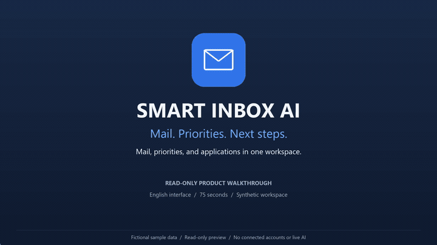
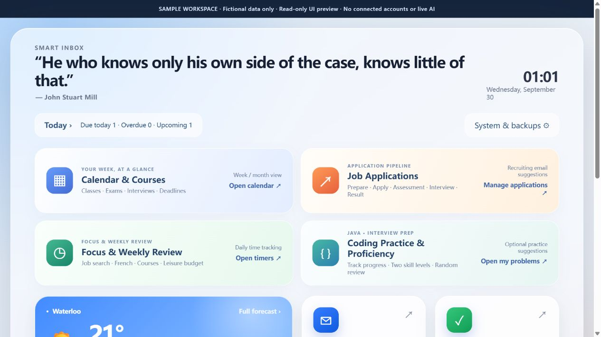
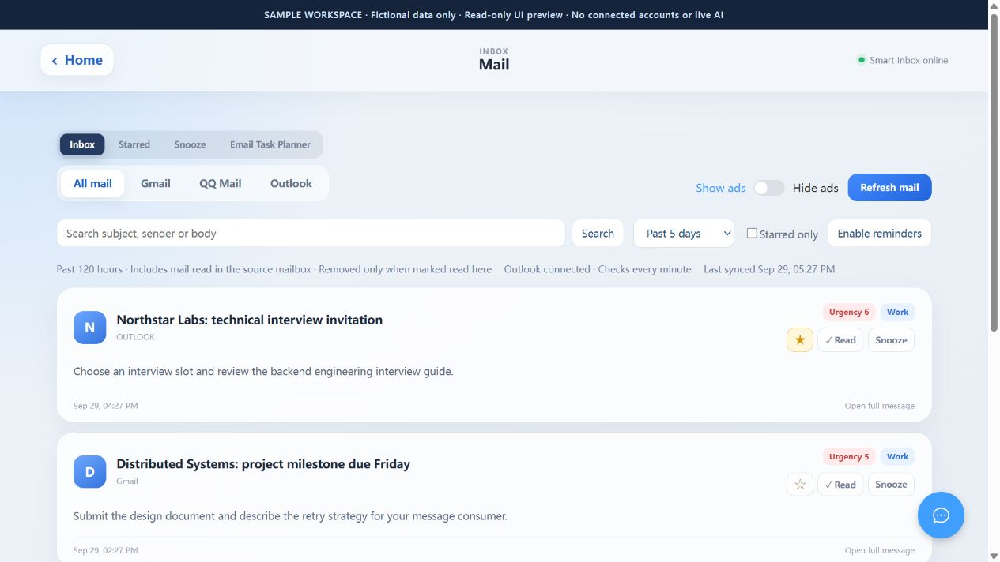
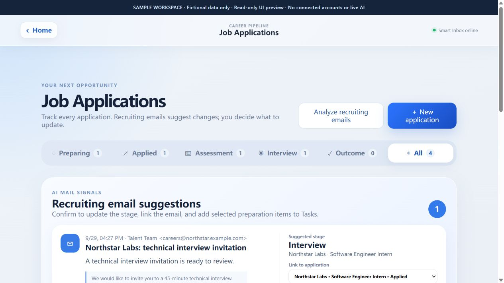
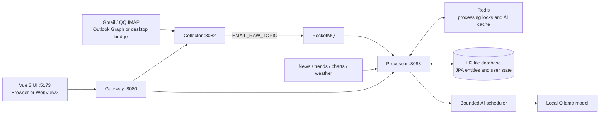

# Smart Inbox AI

### Personal Intelligence Hub · Event-Driven Information & Productivity Platform

A personal workspace that turns incoming email into something you can act on. Smart Inbox combines a unified inbox, local AI analysis, tasks, a calendar, and a job-application tracker in a Vue dashboard, with a Windows desktop launcher.

Built with **Java 17, Spring Boot, Spring Cloud Gateway, RocketMQ, Redis, Spring Data JPA, H2, Vue 3, and Ollama**.

**Project scope:** a working, single-user application for a trusted local computer. The services run as separate processes; this repository does not claim a production cloud deployment, multi-tenant security, or measured production-scale throughput.

[Video walkthrough](#video-walkthrough) · [Screenshots](#screenshots) · [Try the UI](#try-the-ui-no-accounts-needed) · [Features](#features) · [Architecture](#architecture) · [Run locally](#run-locally-windows) · [Tests](#tests)

## Video walkthrough

**75 seconds · English captions · 1080p · No audio**

[](https://github.com/000NK000/smart-inbox-ai/raw/refs/heads/main/docs/demo/smart-inbox-demo.mp4)

**[Watch or download the full video (MP4, 2.5 MB)](https://github.com/000NK000/smart-inbox-ai/raw/refs/heads/main/docs/demo/smart-inbox-demo.mp4)** · [English subtitles](docs/demo/smart-inbox-demo.en.srt) · [Chapters & recording notes](docs/demo/README.md)

An edited walkthrough of the actual English UI: dashboard → mail filters and search → full message → job applications and suggested next steps. Every scene uses **fictional sample data** in the isolated, read-only demo. Recruiting suggestions are preloaded examples; the video does not connect to real accounts, run live AI, or demonstrate write actions.

## Try the UI (no accounts needed)

With Node.js 22.13+ within the 22.x release line, or Node.js 24+, preview the application without connecting a mailbox, starting Java/Docker, or loading a model:

```powershell
cd smart-web
npm ci
npm run demo
```

Open **http://127.0.0.1:5179/demo.html**. The demo uses the real Vue interface with fictional fixtures and supports the **dashboard, mail list/details, and job-application board**. It is a read-only visual preview: other panels and write actions are intentionally unavailable, and no live AI analysis runs.

The separate demo configuration has no backend API proxy or runtime-control plugin. Demo requests resolve to fixtures or fail explicitly; location access is disabled. Use the [full local setup](#run-locally-windows) for live integrations and persistent workflows.

## Screenshots

The screenshots use the **English interface and synthetic demonstration data**. Names, messages, applications, and tasks shown here are examples, not a real inbox or personal records.

### One workspace for the day

Navigate between mail, tasks, calendar, job applications, focus sessions, coding practice, news, and watchlists.



### Email with context and follow-up actions

Read the message, manage its local inbox state, and request an explanation or review suggested tasks.



### Job applications connected to recruiting mail

Track an application from preparation to outcome, with related messages and suggested next steps.



## Features

| Area | What it does |
| --- | --- |
| **Unified inbox** | Collects recent Gmail, QQ Mail, and Outlook/Microsoft 365 messages. Supports search, source filters, local read state, stars, snoozing, and HTML message details. |
| **Local AI assistance** | Classifies and summarizes incoming mail; produces on-demand Chinese explanations and task suggestions with source evidence. Suggestions become tasks only after confirmation. |
| **Tasks & calendar** | Stores priorities, deadlines, completion status, recurring events, and course/interview schedules. Shows time conflicts and overdue work. |
| **Job applications** | Tracks preparation, applied, assessment, interview, and outcome stages. Recruiting-mail suggestions can link a message, update a stage, and create selected preparation tasks. |
| **Focus & review** | Records time spent on job search, French, and coursework; uses a configurable daily entertainment budget. Supports task-linked sessions, keyboard shortcuts, and daily/weekly totals. |
| **Coding practice** | Records independently solved vs. needs-practice problems, groups by topic, and randomly selects a weak problem. Topic notes and individual solutions support text, code, and screenshots. |
| **Discovery** | Offers weather, social trends, U.S. news, independent Douban/IMDb/Rotten Tomatoes charts, and a personal watchlist. Source health and cached-data status are visible. |
| **Desktop & operations** | Windows WebView2 shell, tray controls, standby/resume, source diagnostics, AI queue status, and personal-data backup/restore. |

The English/Chinese toggle changes the **interface**, not the user's mail, notes, titles, or generated reports. Chinese mail analysis and news briefs remain Chinese. English mode uses its own English philosophy quotes on the home screen.

### A typical workflow

1. A new assessment invitation is collected and processed asynchronously.
2. The inbox shows its source, summary, classification, and priority.
3. The user opens the full message and requests an explanation or reviews extracted actions.
4. The user confirms the matching application and chosen preparation tasks.
5. The task appears alongside calendar deadlines and can be associated with a focus session.

Marking a message read in Smart Inbox hides it from the local inbox and removes its unconfirmed mail-planning suggestions. Tasks already accepted by the user remain. These actions do **not** change the source mailbox's read or starred state.

## Architecture



### Engineering highlights

- **Retry-safe ingestion:** stable message identities, collector checkpoints, Redis locks with ownership-checked release, and a database uniqueness constraint work together to handle duplicate delivery. Failed consumer work is surfaced to RocketMQ for retry.
- **Bounded local inference:** one shared priority queue limits concurrent model calls, combines identical in-flight requests, and includes queue time in each request's deadline. Interactive requests take priority over queued background analysis; running work is not preempted.
- **Smaller reads:** paginated inbox queries project list fields without loading full text/HTML bodies. Revision checks, visibility-aware polling, and cached source responses reduce unnecessary transfers and repeated work.
- **Explicit state ownership:** synchronization enriches message bodies without overwriting local read/star state. Version checks reject stale edits to tasks and other personal records with conflict responses.
- **Human-reviewed AI actions:** structured model output is validated; task proposals retain source evidence. Company identity is checked before recruiting mail is matched to an application, and ambiguous matches require user selection.
- **Recoverable UI and runtime:** lazy panels have loading, timeout, and retry states. Standby shuts down project services and unloads the configured model, while retaining a lightweight interface for resuming.

These are implemented design choices, not benchmark claims. See [architecture and failure-handling notes](docs/architecture.md) for code entry points, tradeoffs, and test coverage.

### Repository layout

| Path | Responsibility |
| --- | --- |
| `smart-collector/` | Mail connectors, synchronization, source health, credential vault |
| `smart-processor/` | Queue consumer, AI scheduling, persistence, productivity APIs, public-source adapters |
| `smart-gateway/` | Routes browser API requests to local services |
| `smart-web/` | Vue application, locale dictionaries, component and utility tests |
| `desktop/` | Windows C# WebView2 shell and native bridge |
| `scripts/` | Startup, installation, desktop serving, standby, and runtime tests |
| `smart-user/` | Reserved service scaffold; not part of the default runtime |

H2 is the current application database. The default startup uses only **Redis and RocketMQ** containers. MySQL, Nacos, Milvus/etcd/MinIO, Prometheus, Grafana, and the RocketMQ dashboard are optional Compose services, not prerequisites for daily use. Vector retrieval is disabled by default.

The project includes Spring AI dependencies and an optional `VectorStore` integration. The active inference path uses Java `HttpClient` against Ollama's OpenAI-compatible endpoint, through the custom request scheduler.

## Run locally (Windows)

The supported convenience scripts target Windows. The desktop installation is tied to the checkout path and uses locally installed runtimes; it is not a self-contained installer for every operating system.

### Prerequisites

- Java 17 and Maven on `PATH`
- Node.js 22.13+ within 22.x, or Node.js 24+, and npm
- Docker Desktop running with Linux containers
- Ollama and sufficient memory for the configured model
- For the desktop shell: .NET Framework 4.8 and Microsoft Edge WebView2 Runtime
- For Outlook's desktop bridge: **classic Outlook**, signed into the intended account in the same Windows user session. The alternative Microsoft Graph connector requires an app registration and tenant-permitted authorization.

### 1. Configure your own environment

From PowerShell in the repository root:

```powershell
Copy-Item config.example.ps1 config.local.ps1
```

Edit `config.local.ps1` before starting:

- Set a nonempty `REDIS_PASSWORD`; Compose requires it.
- Keep the checkout directory named `smart-inbox-ai`, or set `$env:COMPOSE_PROJECT_NAME = 'smart-inbox-ai'` in this local file so standby can identify the project's containers.
- Fill in only the mail accounts you intend to connect. Gmail uses an app password; QQ Mail uses its IMAP authorization code.
- Configure Outlook's account and authorization for the selected connector.
- Optionally set `SMART_INBOX_MANAGEMENT_PASSWORD_SHA256` to the SHA-256 verifier of a management password you choose. Without it, the credential-management UI remains locked.

The startup scripts load this ignored local file. No real accounts, tokens, database files, or model weights are included in the repository. A fresh installation starts with no personal records.

### 2. Install dependencies and the model

```powershell
Push-Location smart-web
npm ci
Pop-Location

ollama pull qwen3.5:9b-q8_0
```

The default model is configured in `smart-processor/src/main/resources/application.yml`. Downloading and loading it can take time and significant disk/memory space. Model latency depends on the machine. If you change models, keep the processor configuration and standby model handling consistent.

### 3. Start the web application

```powershell
powershell.exe -NoProfile -ExecutionPolicy Bypass -File scripts/start-smart-inbox.ps1
```

This starts the minimal containers, builds the Java modules, starts Collector/Processor/Gateway, and opens **http://127.0.0.1:5173/**. It uses a project-local Maven cache at `.codex-m2/`.

After a successful build, use `-SkipBuild` for subsequent starts:

```powershell
powershell.exe -NoProfile -ExecutionPolicy Bypass -File scripts/start-smart-inbox.ps1 -SkipBuild
```

| Component | Default port |
| --- | --- |
| UI / desktop web server | `5173` |
| Gateway | `8080` |
| Collector | `8082` |
| Processor | `8083` |
| Redis on the host | `6380` |
| RocketMQ nameserver / broker | `9876` / `30911` |
| Ollama | `11434` |

Backend startup and the desktop launcher check port ownership. The web startup script reuses an existing listener on port 5173, so make sure it belongs to this app. The scripts do not terminate unrelated programs. Logs are written to `.run-logs/`.

### 4. Optional: install the desktop launcher

After building the backend, exit any running Smart Inbox desktop instance, then run:

```powershell
powershell.exe -NoProfile -ExecutionPolicy Bypass -File scripts/install-desktop.ps1
```

The script builds the frontend and C# shell, downloads the pinned WebView2 SDK if needed, and creates Desktop/Start Menu shortcuts. Keep the checkout in place, or reinstall the launcher after moving it.

- **Close window:** hides the app to the tray; background collection continues.
- **Standby:** pauses collection and AI work, stops this project's backend/containers, and unloads its configured model.
- **Exit app:** stops the project runtime and closes the desktop shell. Shared Docker Desktop and the Ollama service remain installed/running independently.

Before rebuilding a running installation, use its normal exit/standby controls. Backend source changes require rebuilding the JARs; desktop frontend changes require rebuilding `smart-web/dist`.

## Tests

From the repository root, run the Java regression suite:

```powershell
mvn "-Dmaven.repo.local=$PWD\.codex-m2" -pl smart-collector,smart-processor -am test
```

Run the frontend tests and production build:

```powershell
Push-Location smart-web
$testFiles = Get-ChildItem src -Recurse -Filter *.test.js | ForEach-Object FullName
node --test $testFiles
npm run build -- --configLoader runner
Pop-Location
```

Run the desktop/runtime JavaScript tests:

```powershell
$runtimeTests = Get-ChildItem scripts,desktop -Filter *.test.mjs | ForEach-Object FullName
node --test $runtimeTests
```

Tests cover duplicate messages and retry paths, AI queue deadlines, query projections, task conversion, optimistic conflicts, calendar recurrence, application matching, backup validation, HTML sanitization, localization, and desktop/runtime boundaries. Most tests use mocks, synthetic fixtures, or an embedded database; passing them does not verify a live mailbox, external feed, or local model. Those integrations also need a manual smoke check with your own configuration.

## Data, privacy, and limitations

- **Local-first, not fully offline:** application records live in the local H2 database and inference targets local Ollama by default. Mail providers, news/chart/weather sources, and remote email images still involve network access.
- **Personal-use security boundary:** keep the runtime on a trusted local machine. The app does not provide a complete multi-user authentication/authorization layer; publishing this source does not make the running services safe for public internet exposure.
- **Credential separation:** the credential-management API returns masked values and stores the vault encrypted with AES-GCM. Its key is local to the same user account; protect the Windows account, local files, logs, and backups too.
- **Inbox window:** normal synchronization and inbox queries cover the last 120 hours, including mail already read in the source mailbox. Local stars and snoozed reminders have their own retention/display behavior.
- **AI is advisory:** generated analysis may be wrong or incomplete. Original mail remains available, long-message scope limits are disclosed, and accepting a task or application update is a user action.
- **External sources can fail:** RSS, public pages, and provider responses can change or be blocked. Adapters use caches and source-status reporting; unavailable data is not a guarantee of an empty feed. These integrations are not official partnerships.
- **Backups have a defined scope:** the in-app export covers personal productivity records and local mail state, not credentials, OAuth tokens, raw mail bodies, or a full system image. It can still contain personal information and should remain private.
- **No personal data in the showcase:** public screenshots and fixtures are synthetic. Private interview notes, actual inbox data, runtime logs, secrets, and machine-specific configuration are excluded.
