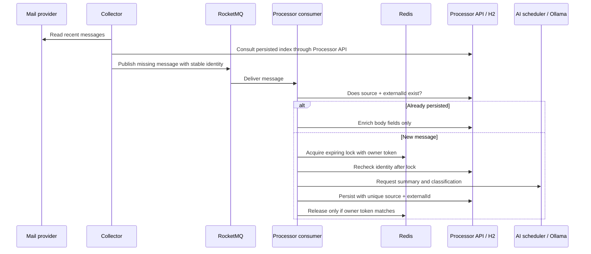
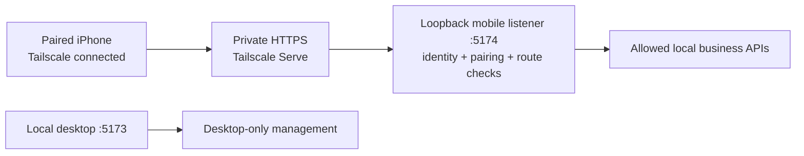

# Architecture and Engineering Notes

Smart Inbox is a personal application with separately running Spring Boot services, asynchronous mail processing, local AI, persistent user workflows, and optional read-only portfolio research. A paired iPhone can access a restricted companion interface through a private network. This guide describes the current code, including its boundaries. It is not a claim of production-scale deployment or exactly-once distributed delivery.

## 1. Runtime boundaries

| Component | Owns | Main entry points |
| --- | --- | --- |
| Collector | Provider access, synchronization, source health, credential management | `EmailCollectorTask`, `ImapEmailService`, `OutlookGraphService`, `OutlookDesktopService` |
| Processor | Durable application state, queue consumption, AI features, productivity APIs | `EmailConsumer`, `AiService`, `MailQueryService`, domain services |
| Gateway | HTTP routing to Collector and Processor | `bootstrap.yml` and the domain route configuration classes |
| Frontend | Presentation, local interface preferences, drafts, interaction state | `InboxWorkspace.vue`, `components/`, `stores/`, `i18n/` |
| Desktop/runtime controller | Windows window/tray lifecycle, process orchestration, standby/resume | `SmartInbox.cs`, `runtime-control.mjs`, PowerShell scripts |
| Private mobile entry point | Tailscale identity checks, device pairing, allowed business routes | `mobile-network.mjs`, `mobile-access.mjs` |

The normal startup runs three Java processes and the Redis/RocketMQ infrastructure. Application data is held in a local H2 file via Spring Data JPA. The `smart-user` scaffold is not started, Nacos registration is disabled by the startup command, and optional vector retrieval is off.

This layout separates provider failures, asynchronous processing, and interactive API work, while remaining manageable on a personal computer. It also introduces real coordination problems: messages can be delivered twice, dependencies can be unavailable, and several browser windows can edit the same record.

## 2. Email ingestion and duplicate handling

The database access shown for the Collector is through the Processor's sync-index API; the Collector does not open the H2 file.

### Why more than one deduplication mechanism?

1. **Provider identity** gives each message a stable key across repeated synchronization.
2. **Collector checkpoints** suppress recently published messages temporarily. A successful publish is not treated as proof that the Processor committed a database row.
3. **Redis processing locks** avoid concurrent model calls for the same message. A busy lock raises an error so the queue can retry, rather than silently acknowledging unpersisted work.
4. **Database uniqueness** is the final authority on whether a message already exists. A constraint failure is considered a duplicate only after the same identity is confirmed in storage.
5. **Ownership-checked lock release** uses a Redis script so a delayed consumer cannot delete a lock acquired by another worker after expiration.

The consumer lets processing failures propagate to RocketMQ. If a process stops after persistence but before acknowledgment, a redelivery sees the existing row. If model analysis is temporarily unavailable, `AiService` can preserve a message with an explicit offline-analysis status for later repair.

These measures make repeat processing safe for the covered paths. There is no transaction spanning the provider, RocketMQ, Redis, and H2; the system is not exactly-once. Queue exhaustion, permanent invalid messages, outages beyond the collection window, and machine/storage failure still require operational handling.

**Read the code:**

- [`EmailConsumer.java`](../smart-processor/src/main/java/com/smartinbox/processor/listener/EmailConsumer.java)
- [`PendingMailIndex.java`](../smart-collector/src/main/java/com/smartinbox/collector/util/PendingMailIndex.java)
- [`MailSummary.java`](../smart-processor/src/main/java/com/smartinbox/processor/entity/MailSummary.java)
- [`EmailConsumerTest.java`](../smart-processor/src/test/java/com/smartinbox/processor/listener/EmailConsumerTest.java)

## 3. Scheduling a local model

Several features share one model: ingestion summaries, chat, mail explanations, task extraction, recruiting-mail analysis, weather summaries, and news briefs. Calling the model freely from all of them would compete for the same local compute and increase waiting time.

`AiRequestScheduler` provides:

- A bounded pending queue; excess work is rejected explicitly.
- Configurable concurrency, defaulting to one worker and capped at two.
- Priority ordering for queued work, favoring interactive requests over background analysis.
- A shared result for identical in-flight requests instead of another model call.
- A deadline covering queue wait, network work, and any retry delay.
- At most one retry for transient I/O failures within the remaining budget.
- Cancellation and status counters for the operations panel.

Scheduling is **process-local and non-preemptive**. A high-priority request can move ahead of pending background work, but cannot interrupt an already running inference. A processor restart loses its in-memory queue; persisted mail/task-analysis state enables later retries where supported.

`AiService` sends requests using Java `HttpClient` to Ollama's `/v1/chat/completions`. Spring AI dependencies and optional `VectorStore` support remain in the project; vector retrieval is disabled in the default runtime. Stock research uses a separate, manually requested remote GPT integration described below; it is not part of this local model queue.

**Read the code:** [`AiRequestScheduler.java`](../smart-processor/src/main/java/com/smartinbox/processor/service/AiRequestScheduler.java), [`AiService.java`](../smart-processor/src/main/java/com/smartinbox/processor/service/AiService.java), and [`AiRequestSchedulerTest.java`](../smart-processor/src/test/java/com/smartinbox/processor/service/AiRequestSchedulerTest.java).

## 4. Turning model output into user-controlled actions

AI output is treated as proposed structured data. Services validate fields, allowed values, lengths, and expected language before returning a report or saving a suggestion.

### Mail planning

Long email bodies are processed in chunks for task planning. Suggestions include their source mail and evidence; content fingerprints avoid reanalyzing unchanged messages. Overlapping chunks should not create duplicate actions. Confirming a suggestion creates a persistent task, with a uniqueness constraint on the originating mail/suggestion pair.

Local inbox read state and task completion are separate concepts. Marking mail read removes unaccepted proposals from the active mail plan; it does not delete a task the user has already accepted.

### Recruiting-mail matching

Company identity is established before matching a role. A generic title such as “Software Developer Intern” does not establish the employer. Name normalization handles punctuation and legal suffixes; ambiguous applications from the same employer are left for user selection. Applying a suggestion is a confirmed operation, not an autonomous stage change.

### Analysis limits

Task planning and an on-demand mail explanation have different input budgets. For example, the explanation service limits a long body and returns a scope note when the middle was omitted. Structured validation reduces malformed responses; it cannot prove the model's factual correctness. Users must be able to inspect the original message.

**Read the code:** [`MailTaskAnalyzer.java`](../smart-processor/src/main/java/com/smartinbox/processor/mail/MailTaskAnalyzer.java), [`MailTaskPlanService.java`](../smart-processor/src/main/java/com/smartinbox/processor/mail/MailTaskPlanService.java), [`MailInsightService.java`](../smart-processor/src/main/java/com/smartinbox/processor/mail/MailInsightService.java), and [`JobApplicationService.java`](../smart-processor/src/main/java/com/smartinbox/processor/job/JobApplicationService.java).

## 5. Database reads and concurrent edits

Mail bodies can be much larger than list metadata. `MailQueryService` builds paginated DTO projections that omit both full-content columns. Opening one message fetches the body separately. Revision checks let clients determine whether a list changed before downloading it again; polling depends on page visibility.

Tasks, calendar events, applications, practice notes, and watchlist records use version-aware writes. A client submits the version it edited; a stale write receives a conflict instead of silently overwriting a newer value. This is useful even in a single-user application because a browser and a desktop window may both be open.

These measures reduce unnecessary work; no production latency improvement is claimed without measurements. H2 and local files are practical here, but a shared multi-user deployment would need a different persistence, migration, authorization, and operations plan.

**Read the code:** [`MailQueryService.java`](../smart-processor/src/main/java/com/smartinbox/processor/mail/MailQueryService.java), [`TaskService.java`](../smart-processor/src/main/java/com/smartinbox/processor/service/TaskService.java), and [`MailQueryIntegrationTest.java`](../smart-processor/src/test/java/com/smartinbox/processor/mail/MailQueryIntegrationTest.java).

## 6. External sources and degraded operation

Public feeds and pages are not stable database contracts. A provider may time out, change markup, reject a request, or return fewer items than expected.

Adapters report source status and use bounded caches. Successful public-source snapshots can survive restarts; failed refreshes must not replace a good snapshot with an empty result. The UI distinguishes fresh results, cached/stale results, and unavailable sources. Charts remain separate by provider, and a film/news detail panel provides an explicit link to the source.

Snapshots have age and size limits. Cached content is not presented as a guaranteed live result. Neither a cache nor a retry can guarantee continued access to a third-party source.

**Read the code:** [`SourceSnapshotStore.java`](../smart-processor/src/main/java/com/smartinbox/processor/cache/SourceSnapshotStore.java), [`WatchService.java`](../smart-processor/src/main/java/com/smartinbox/processor/watch/WatchService.java), and [`DashboardController.java`](../smart-processor/src/main/java/com/smartinbox/processor/controller/DashboardController.java).

## 7. Effective and ineffective time

The focus model now has two categories: **effective time** and **ineffective time**. The runtime starts a new tracking session as ineffective time, even before the focus panel is opened. Records are persisted locally, with 7-day, 1-month, and 3-month history views. The view window is not a deletion policy; the service does not prune older records after three months. Legacy job-search, French, and coursework records count as effective time; legacy entertainment records count as ineffective time.

### Accounting for interruptions

The timer belongs to the desktop/runtime process, not a particular browser tab. A presence helper sends a heartbeat every 15 seconds with a 45-second lease. Switching categories closes the current session and opens the next one in a transaction. The expected active-session ID prevents a delayed request from toggling a newer session, and the local service serializes these transitions through transaction completion.

If the runtime disappears, sleeps, or loses its lease, reconciliation closes the old session at the last confirmed heartbeat. It does not count an unobserved overnight gap as work or leisure. This conservative choice can omit the short interval after the last heartbeat. Standby and normal exit explicitly stop presence. A fresh runtime starts a new ineffective-time session; a phone request to switch categories does not extend proof that the PC is still active.

Daily totals split sessions at local calendar boundaries, including daylight-saving changes. Both categories accumulate elapsed time; neither is an entertainment countdown.

### Keyboard and request safety

Enter switches the category across Smart Inbox pages. This is an application shortcut, not a system-wide keyboard hook. It ignores text entry, input-method composition, held-key repeats, modifier combinations, interactive controls, open dialogs, and hidden/inactive UI states. Buttons remain available for touch use.

A shared frontend controller prevents simultaneous toggles and stale refresh results from overwriting a newer state. If a toggle request has an uncertain outcome, the controller reads the state back rather than retrying the same toggle and potentially reversing a successful change. The focus page also uses explicit labels and different backgrounds for the two modes.

**Read the code:** [`FocusService.java`](../smart-processor/src/main/java/com/smartinbox/processor/service/FocusService.java), [`focus-presence.mjs`](../scripts/focus-presence.mjs), [`focusController.js`](../smart-web/src/stores/focusController.js), [`focusShortcut.js`](../smart-web/src/utils/focusShortcut.js), and [`FocusCenter.vue`](../smart-web/src/components/FocusCenter.vue).

## 8. Read-only portfolio data and manual GPT research

The stock center separates broker authorization, market/account data, local watchlist records, and GPT research. An IBKR connection supplies data; the GPT connection is independent and is used only when the user requests a report. Available accounts and models depend on the configured provider connection.

### Data boundaries

- The IBKR adapter uses a closed tool allowlist for positions, balances, account summaries, portfolio performance, contract search, price snapshots, and price history. Order/trading tools are not included.
- Holdings totals remain separated by currency. Broker account values and cash are displayed as distinct fields; cash is not added to a total that already includes it. Buying power is not presented as cash.
- Missing fields remain unavailable rather than becoming zero. A failure to retrieve balances does not discard an otherwise valid holdings snapshot.
- Portfolio refreshes use a short cache; stale fallback is labeled. Source and snapshot timestamps remain visible. Refreshing does not imply a continuous real-time market feed.

The chart supports **2 hours, 1 day, 1 week, 15 days, 1 month, and 1 year**. Stock/ETF history is requested for the selected held security's broker contract. The 2-hour total-portfolio view uses locally observed net-liquidation snapshots; it cannot fabricate history from before those observations. Longer portfolio ranges use the broker's performance history. Account net value includes cash and can change because of deposits or withdrawals; its movement is not an investment return. Point, currency, and timestamp validation rejects malformed series, and missing data is not interpolated. Security history uses regular trading sessions; availability and delayed-data status depend on the broker response.

### Research request boundary

Generating a Chinese report is an explicit user action. The service permits one report at a time and prepares a bounded research input from the selected snapshot, with source/time context. It omits credentials, account identifiers, local paths, and raw broker responses from the model input. The selected research data is sent to the authorized remote GPT service, unlike the local Ollama mail-analysis path.

Reports and versioned watchlist notes are stored locally. The report is advisory text: it does not place an order, change a holding, or automatically act on a suggested investment. Connection secrets are kept separately from these application records and are not exposed in report content.

**Read the code:** [`StockService.java`](../smart-processor/src/main/java/com/smartinbox/processor/stocks/StockService.java), [`StockIbkrService.java`](../smart-processor/src/main/java/com/smartinbox/processor/stocks/ibkr/StockIbkrService.java), [`StockAccountData.java`](../smart-processor/src/main/java/com/smartinbox/processor/stocks/ibkr/StockAccountData.java), [`StockHistoryData.java`](../smart-processor/src/main/java/com/smartinbox/processor/stocks/ibkr/StockHistoryData.java), [`StockGptService.java`](../smart-processor/src/main/java/com/smartinbox/processor/stocks/gpt/StockGptService.java), and [`StockHistoryChart.vue`](../smart-web/src/components/StockHistoryChart.vue).

## 9. Desktop lifecycle and frontend updates

The Windows app embeds the built Vue interface through WebView2. It shares the backend and H2 data with the browser interface. The launcher uses the installed Java, Node, Docker, and Ollama runtimes; it is not a bundled virtual machine or a general-purpose Windows installer.

Closing the window hides it to the tray. Standby is a project operation: stop the Java services, unload the configured model, and stop project containers without deleting their data. A small local frontend controller remains available to resume. Exiting the desktop app also closes the app-owned frontend server. It does not shut down Windows or promise zero system memory use.

### Parallel startup with readiness checks

The orchestration first makes the queue route available. The backend helper then preflights all three JARs, detects duplicate owned processes and foreign port listeners, and reuses eligible existing processes. Only after those checks does it launch Processor, Collector, and Gateway before waiting for readiness. This allows their initialization to overlap without treating a process launch as a successful startup.

Readiness combines process liveness with bounded HTTP checks: Processor health, Collector's Outlook status endpoint, and the Gateway's mail-list endpoint. The latter verifies a routed business read. The Outlook status query reads cached synchronization metadata; it does not open Outlook. Timing records identify slow startup stages, but Docker readiness, model load, and machine resources still determine actual startup time.

### Graceful shutdown before dependency removal

Shutdown requests stops from owned Gateway, Collector, and Processor processes before unloading the configured model or stopping dependencies. If a JVM does not finish within its bounded wait, the operation reports failure rather than force-killing it and continuing as if persistence had completed.

RocketMQ is stopped through its broker and nameserver shutdown commands. This avoids relying on a container shell to forward a signal correctly. Exit status and out-of-memory state are checked; an incomplete queue shutdown leaves dependencies available for recovery. Container selection checks both Compose project identity and the checkout working directory. Restart-policy handling prevents the queue from immediately restarting during a deliberate stop and is restored during startup. These safeguards reduce avoidable failures; they cannot eliminate power-loss or storage failures.

### Silent classic Outlook access

The bridge reuses an existing COM instance where available. Before creating an instance, it requires a valid default profile, disabled profile prompting, and no existing profile-selection dialog. It initializes MAPI through `GetNamespace('MAPI')` and `GetDefaultFolder(6)` without requesting an Explorer window. It does not start `OUTLOOK.EXE /profile`, call `Logon`, or fall back to displaying a window. It also does not close the user's Outlook windows or quit their session.

Classic Outlook may still run as a background process while the bridge uses it. Missing/ambiguous profiles and initialization failures return explicit status instead of repeatedly launching a main window. Profile preferences must be effective in the actual Windows context that runs the Collector; a developer tool's isolated registry view is not sufficient evidence. User-specific Windows settings and account repairs are local setup, not repository configuration.

Frontend sections load lazily. Explicit loading/error states and retry controls prevent a failed chunk request from becoming an unexplained blank screen. Builds preserve existing content-hashed assets so a window opened before an update can still load its older chunks. This trades some disk space for compatibility; obsolete asset cleanup is a separate deployment concern.

**Read the code:** [`runtime-control.mjs`](../scripts/runtime-control.mjs), [`backend-startup.ps1`](../scripts/backend-startup.ps1), [`runtime-action.ps1`](../scripts/runtime-action.ps1), [`runtime-shutdown.ps1`](../scripts/runtime-shutdown.ps1), [`outlook-session.ps1`](../scripts/outlook-session.ps1), [`SmartInbox.cs`](../desktop/SmartInbox.cs), and [`asyncPanel.js`](../smart-web/src/utils/asyncPanel.js).

## 10. Private iPhone access

The companion is a Home Screen web app backed by the same local services and database, not a native iOS package or a cloud replica. The PC must remain awake with the runtime available; the phone must connect to the same private Tailscale network. Cellular and school Wi-Fi do not need to share the PC's LAN. Standby blocks companion access, and the frontend does not provide continuous iOS background synchronization.

The setup helper uses **Serve, not public Funnel**, and refuses to overwrite another service's HTTPS configuration. The separate mobile listener binds to loopback only when valid local configuration exists. It verifies the configured Host, same-origin requests, and Tailscale's authenticated user header.

Pairing adds an application-level device boundary: a one-use code expires after 10 minutes; the resulting session expires after 30 days and can be revoked from the PC. The cookie is `Secure`, `HttpOnly`, and `SameSite=Strict`; persisted session secrets are hashed. Each business request must also match an explicit HTTP method/path allowlist.

Allowed features include mail, tasks, calendar, applications, focus, practice, news/watch workflows, and stocks. **Credentials, backup/restore, account authorization, and computer lifecycle controls are desktop-only.** Existing AI analysis remains manually initiated. Pairing does not give the phone general access to local files, arbitrary API routes, or trading operations. Private content is not stored in a service-worker offline cache.

This is a narrow personal-device access model, not a substitute for multi-tenant authorization. Physical-device HTTPS, foreground refresh, and network-reconnection behavior still need verification on the intended phone.

**Read the setup and code:** [Private iPhone access](../scripts/MOBILE-ACCESS.md), [`mobile-network.mjs`](../scripts/mobile-network.mjs), [`mobile-access.mjs`](../scripts/mobile-access.mjs), and [`mobileAccess.js`](../smart-web/src/utils/mobileAccess.js).

## 11. Data and security boundaries

- The credential API supplies masked values and requires a short-lived management authorization for protected operations. The persisted vault uses AES-GCM; its local key still needs protection by the operating-system account.
- HTML mail is sanitized and shown in a sandboxed iframe. Remote images may still contact external servers; local inference does not make mail viewing fully offline.
- Source mail content is treated as untrusted input in prompts. This is a defense-in-depth measure, not proof against every prompt injection.
- The local Ollama path and remote GPT stock-research path have different data boundaries. A manual stock report shares its prepared research input with the authorized remote service; broker/GPT secrets, pairing state, and machine-specific settings stay out of public assets and version control.
- In-app backup files are versioned and validated before restore. They exclude raw mail and credentials but include personal productivity data and notes; they must not be published.
- The application has no complete multi-user access-control model. Keep the runtime local, with only the optional paired private companion entry point. Do not expose API/infrastructure ports or replace private Serve with public Funnel.

## 12. Verification strategy

| Layer | Representative checks |
| --- | --- |
| Collector | Recent-mail window, Outlook/IMAP incremental behavior, pending publication retries, credential authorization |
| Queue consumer | Duplicate persistence, contention, ownership-safe release, failure propagation |
| AI scheduler | Concurrency bounds, ordering, deadline expiry, in-flight coalescing, cancellation |
| Persistence | Lightweight mail projections, stale versions, duplicate task conversion, backup validation |
| Workflows | Recurrence/time conflicts, heartbeat expiry, focus day boundaries and category transitions, recruiting-mail matching, practice-note data |
| Stocks | Read-only tool selection, balance/history validation, missing and stale data, report input boundaries |
| Frontend | Component interactions, locale changes, preserved drafts, mail sanitization, lazy-panel recovery, app-wide Enter guards and toggle reconciliation |
| Runtime | Port/artifact preflight, parallel readiness, graceful shutdown ordering, silent COM guards, desktop bridge restrictions, lifecycle and static serving |
| Private mobile | Pairing expiry/revocation, identity and origin checks, method/path allowlist, denied management operations, offline states |

Automated tests use synthetic inputs and controlled dependencies. In particular, the PowerShell Outlook suite uses fake COM/registry behavior rather than launching Outlook or reading mail. These tests do not replace a smoke check of the configured Outlook session, broker/GPT authorization, available model memory, current third-party feeds, or a physical iPhone connection. Test commands and setup requirements are in the [README](../README.md#tests).
