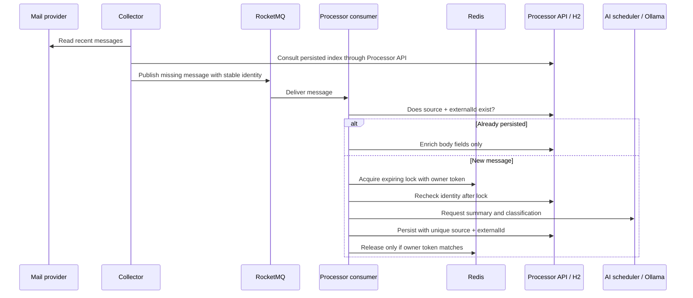

# Architecture and Engineering Notes

Smart Inbox is a personal application with separately running Spring Boot services, asynchronous mail processing, a local model, and persistent user workflows. This guide describes the current code, including its boundaries. It is not a claim of production-scale deployment or exactly-once distributed delivery.

## 1. Runtime boundaries

| Component | Owns | Main entry points |
| --- | --- | --- |
| Collector | Provider access, synchronization, source health, credential management | `EmailCollectorTask`, `ImapEmailService`, `OutlookGraphService`, `OutlookDesktopService` |
| Processor | Durable application state, queue consumption, AI features, productivity APIs | `EmailConsumer`, `AiService`, `MailQueryService`, domain services |
| Gateway | HTTP routing to Collector and Processor | `bootstrap.yml` and the domain route configuration classes |
| Frontend | Presentation, local interface preferences, drafts, interaction state | `InboxWorkspace.vue`, `components/`, `stores/`, `i18n/` |
| Desktop/runtime controller | Windows window/tray lifecycle, process orchestration, standby/resume | `SmartInbox.cs`, `runtime-control.mjs`, PowerShell scripts |

The normal startup runs three Java processes and the Redis/RocketMQ infrastructure. Application data is held in a local H2 file via Spring Data JPA. The `smart-user` scaffold is not started, Nacos registration is disabled by the startup command, and optional vector retrieval is off.

This layout separates provider failures, asynchronous processing, and interactive API work, while remaining manageable on a personal computer. It also introduces real coordination problems: messages can be delivered twice, dependencies can be unavailable, and several browser windows can edit the same record.

## 2. Email ingestion and duplicate handling

The database access shown for the Collector is through the Processor's sync-index API; the Collector does not open the H2 file.

### Why more than one deduplication mechanism?

1. **Provider identity** gives each message a stable key across repeated synchronization.
2. **Collector checkpoints** suppress recently published messages temporarily. A successful publish is not treated as proof that the Processor committed a database row.
3. **Redis processing locks** avoid concurrent model calls for the same message. A busy lock raises an error so the queue can retry, rather than silently acknowledging unpersisted work.
4. **Database uniqueness** is the final authority on whether a message already exists. A constraint failure is considered a duplicate only after the same identity is confirmed in storage.
5. **Ownership-checked lock release** uses a Redis script so a delayed consumer cannot delete a lock acquired by another worker after expiration.

The consumer lets processing failures propagate to RocketMQ. If a process stops after persistence but before acknowledgment, a redelivery sees the existing row. If model analysis is temporarily unavailable, `AiService` can preserve a message with an explicit offline-analysis status for later repair.

These measures make repeat processing safe for the covered paths. There is no transaction spanning the provider, RocketMQ, Redis, and H2; the system is not exactly-once. Queue exhaustion, permanent invalid messages, outages beyond the collection window, and machine/storage failure still require operational handling.

**Read the code:**

- [`EmailConsumer.java`](../smart-processor/src/main/java/com/smartinbox/processor/listener/EmailConsumer.java)
- [`PendingMailIndex.java`](../smart-collector/src/main/java/com/smartinbox/collector/util/PendingMailIndex.java)
- [`MailSummary.java`](../smart-processor/src/main/java/com/smartinbox/processor/entity/MailSummary.java)
- [`EmailConsumerTest.java`](../smart-processor/src/test/java/com/smartinbox/processor/listener/EmailConsumerTest.java)

## 3. Scheduling a local model

Several features share one model: ingestion summaries, chat, mail explanations, task extraction, recruiting-mail analysis, weather summaries, and news briefs. Calling the model freely from all of them would compete for the same local compute and increase waiting time.

`AiRequestScheduler` provides:

- A bounded pending queue; excess work is rejected explicitly.
- Configurable concurrency, defaulting to one worker and capped at two.
- Priority ordering for queued work, favoring interactive requests over background analysis.
- A shared result for identical in-flight requests instead of another model call.
- A deadline covering queue wait, network work, and any retry delay.
- At most one retry for transient I/O failures within the remaining budget.
- Cancellation and status counters for the operations panel.

Scheduling is **process-local and non-preemptive**. A high-priority request can move ahead of pending background work, but cannot interrupt an already running inference. A processor restart loses its in-memory queue; persisted mail/task-analysis state enables later retries where supported.

`AiService` sends requests using Java `HttpClient` to Ollama's `/v1/chat/completions`. Spring AI dependencies and optional `VectorStore` support remain in the project; vector retrieval is disabled in the default runtime.

**Read the code:** [`AiRequestScheduler.java`](../smart-processor/src/main/java/com/smartinbox/processor/service/AiRequestScheduler.java), [`AiService.java`](../smart-processor/src/main/java/com/smartinbox/processor/service/AiService.java), and [`AiRequestSchedulerTest.java`](../smart-processor/src/test/java/com/smartinbox/processor/service/AiRequestSchedulerTest.java).

## 4. Turning model output into user-controlled actions

AI output is treated as proposed structured data. Services validate fields, allowed values, lengths, and expected language before returning a report or saving a suggestion.

### Mail planning

Long email bodies are processed in chunks for task planning. Suggestions include their source mail and evidence; content fingerprints avoid reanalyzing unchanged messages. Overlapping chunks should not create duplicate actions. Confirming a suggestion creates a persistent task, with a uniqueness constraint on the originating mail/suggestion pair.

Local inbox read state and task completion are separate concepts. Marking mail read removes unaccepted proposals from the active mail plan; it does not delete a task the user has already accepted.

### Recruiting-mail matching

Company identity is established before matching a role. A generic title such as “Software Developer Intern” does not establish the employer. Name normalization handles punctuation and legal suffixes; ambiguous applications from the same employer are left for user selection. Applying a suggestion is a confirmed operation, not an autonomous stage change.

### Analysis limits

Task planning and an on-demand mail explanation have different input budgets. For example, the explanation service limits a long body and returns a scope note when the middle was omitted. Structured validation reduces malformed responses; it cannot prove the model's factual correctness. Users must be able to inspect the original message.

**Read the code:** [`MailTaskAnalyzer.java`](../smart-processor/src/main/java/com/smartinbox/processor/mail/MailTaskAnalyzer.java), [`MailTaskPlanService.java`](../smart-processor/src/main/java/com/smartinbox/processor/mail/MailTaskPlanService.java), [`MailInsightService.java`](../smart-processor/src/main/java/com/smartinbox/processor/mail/MailInsightService.java), and [`JobApplicationService.java`](../smart-processor/src/main/java/com/smartinbox/processor/job/JobApplicationService.java).

## 5. Database reads and concurrent edits

Mail bodies can be much larger than list metadata. `MailQueryService` builds paginated DTO projections that omit both full-content columns. Opening one message fetches the body separately. Revision checks let clients determine whether a list changed before downloading it again; polling depends on page visibility.

Tasks, calendar events, applications, practice notes, and watchlist records use version-aware writes. A client submits the version it edited; a stale write receives a conflict instead of silently overwriting a newer value. This is useful even in a single-user application because a browser and a desktop window may both be open.

These measures reduce unnecessary work; no production latency improvement is claimed without measurements. H2 and local files are practical here, but a shared multi-user deployment would need a different persistence, migration, authorization, and operations plan.

**Read the code:** [`MailQueryService.java`](../smart-processor/src/main/java/com/smartinbox/processor/mail/MailQueryService.java), [`TaskService.java`](../smart-processor/src/main/java/com/smartinbox/processor/service/TaskService.java), and [`MailQueryIntegrationTest.java`](../smart-processor/src/test/java/com/smartinbox/processor/mail/MailQueryIntegrationTest.java).

## 6. External sources and degraded operation

Public feeds and pages are not stable database contracts. A provider may time out, change markup, reject a request, or return fewer items than expected.

Adapters report source status and use bounded caches. Successful public-source snapshots can survive restarts; failed refreshes must not replace a good snapshot with an empty result. The UI distinguishes fresh results, cached/stale results, and unavailable sources. Charts remain separate by provider, and a film/news detail panel provides an explicit link to the source.

Snapshots have age and size limits. Cached content is not presented as a guaranteed live result. Neither a cache nor a retry can guarantee continued access to a third-party source.

**Read the code:** [`SourceSnapshotStore.java`](../smart-processor/src/main/java/com/smartinbox/processor/cache/SourceSnapshotStore.java), [`WatchService.java`](../smart-processor/src/main/java/com/smartinbox/processor/watch/WatchService.java), and [`DashboardController.java`](../smart-processor/src/main/java/com/smartinbox/processor/controller/DashboardController.java).

## 7. Desktop lifecycle and frontend updates

The Windows app embeds the built Vue interface through WebView2. It shares the backend and H2 data with the browser interface. The launcher uses the installed Java, Node, Docker, and Ollama runtimes; it is not a bundled virtual machine or a general-purpose Windows installer.

Closing the window hides it to the tray. Standby is a project operation: stop the Java services, unload the configured model, and stop project containers without deleting their data. A small local frontend controller remains available to resume. Exiting the desktop app also closes the app-owned frontend server. It does not shut down Windows or promise zero system memory use.

Frontend sections load lazily. Explicit loading/error states and retry controls prevent a failed chunk request from becoming an unexplained blank screen. Builds preserve existing content-hashed assets so a window opened before an update can still load its older chunks. This trades some disk space for compatibility; obsolete asset cleanup is a separate deployment concern.

**Read the code:** [`runtime-control.mjs`](../scripts/runtime-control.mjs), [`runtime-action.ps1`](../scripts/runtime-action.ps1), [`SmartInbox.cs`](../desktop/SmartInbox.cs), and [`asyncPanel.js`](../smart-web/src/utils/asyncPanel.js).

## 8. Data and security boundaries

- The credential API supplies masked values and requires a short-lived management authorization for protected operations. The persisted vault uses AES-GCM; its local key still needs protection by the operating-system account.
- HTML mail is sanitized and shown in a sandboxed iframe. Remote images may still contact external servers; local inference does not make mail viewing fully offline.
- Source mail content is treated as untrusted input in prompts. This is a defense-in-depth measure, not proof against every prompt injection.
- In-app backup files are versioned and validated before restore. They exclude raw mail and credentials but include personal productivity data and notes; they must not be published.
- The application has no complete multi-user access-control model. Restrict runtime access to a trusted local environment rather than exposing its API and infrastructure ports to the internet.

## 9. Verification strategy

| Layer | Representative checks |
| --- | --- |
| Collector | Recent-mail window, Outlook/IMAP incremental behavior, pending publication retries, credential authorization |
| Queue consumer | Duplicate persistence, contention, ownership-safe release, failure propagation |
| AI scheduler | Concurrency bounds, ordering, deadline expiry, in-flight coalescing, cancellation |
| Persistence | Lightweight mail projections, stale versions, duplicate task conversion, backup validation |
| Workflows | Recurrence/time conflicts, focus accounting, recruiting-mail matching, practice-note data |
| Frontend | Component interactions, locale changes, preserved drafts, mail sanitization, lazy-panel recovery |
| Runtime | Desktop bridge restrictions, lifecycle state handling, static serving, standby/resume controls |

Automated tests use synthetic inputs and controlled dependencies. They do not replace a smoke check of the configured Outlook session, a real provider login, available model memory, or current third-party feeds. Test commands and setup requirements are in the [README](../README.md#tests).
